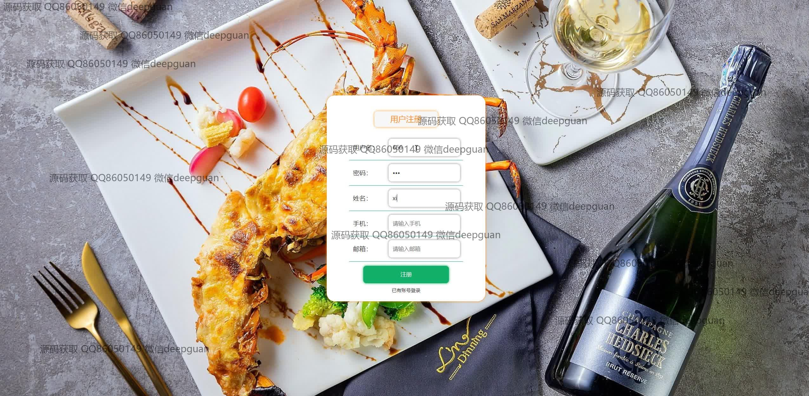
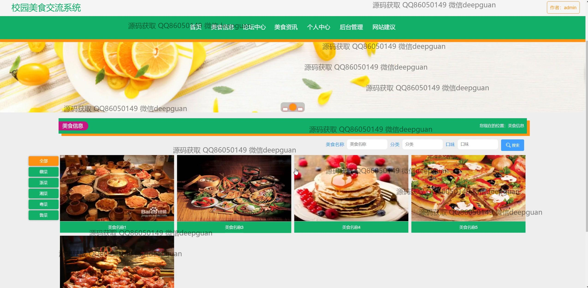
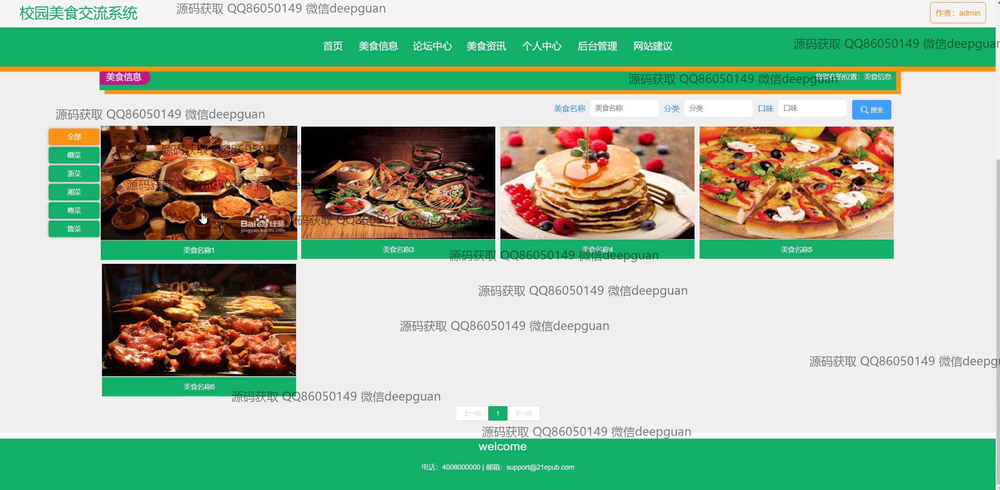

<h1 align="center">校园美食交流系统+vue</h1>

## 简介
校园美食交流系统：角色分为管理员、用户；提供美食信息管理、用户管理、论坛交流、评分和评论、个性化美食推荐、导航搜索等功能。    --计算机毕业设计源码；毕设源码；java毕业设计源码

## 联系方式

<h3 align="center">获取完整代码与数据库文件 + 微信：deepguan QQ: 86050149 QQ群: 783742310</h3>

<h3 align="center">可帮忙远程部署 包运行成功！提供远程部署、修改代码、设计文档指导、代码讲解等服务！</h3>

## 功能介绍（完整见运行截图）
用户： 登录、注册、退出，浏览校园美食信息，进行美食搜索，查看美食详细信息，点击收藏，通过评论区发表、查看、回复评论，可上传图片和视频在美食交流中心分享；访问个人中心修改个人信息，查看美食收藏和管理互动记录。

管理员： 用户管理，包括查看用户信息，角色分配，用户详情、修改、删除等操作，管理员登录、退出功能；管理校园美食分类和信息，权限支持新增、修改、删除操作；管理论坛帖子，支持发布、编辑、回复功能。

美食管理： 管理美食分类和信息，支持美食信息的新增、删除、修改、查看，分类管理包括新增、删除、查看详细分类信息；支持上传图片及视频，提供详细信息编辑功能，便于展示和管理美食内容。

系统功能： 提供导航栏，包括首页、美食信息、论坛中心、用户管理等模块，支持帖子发布和状态管理，网站建议提交和回复反馈，方便师生交流和互动；展示用户评论和评分系统。

## 运行截图

本代码来源于网络,仅供学习参考使用!

